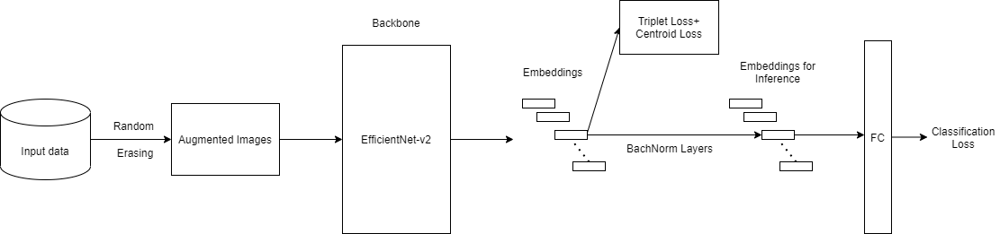

# **deep-efficient-reid**
Experiment for an uni project with strong baseline for Efficientnet-v2

We evaluated the baseline with **Resnet50** and **Efficienet-v2** without using pretrained models. Also **Resnet50-IBN-A** and **Efficientnet-v2** using pretrained on **ImageNet**. We used two datasets: **Market-1501** and **CUHK03**.

<br/>

## **Pipeline**


<br/>

## **Implementation Details**
- Random Erasing to transform input images.
- EfficientNet-v2 / Resnet50 / Resnet50-IBN-A as backbone. 
- Stride = 1 for last convolution layer. Embedding size for Resnet50 / Resnet50-IBN-A is 2048, while for EfficientNet-v2 is 1280. During inference, embedding features will run through a batch norm layer, as known as a bottleneck for better normalization.
* Loss function combining 3 losses:
  1. Triplet Loss with Hard Example Mining.
  2. Classification Loss (Cross Entropy) with Label Smoothing.
  3. Centroid Loss - Center Loss for reducing the distance of embeddings to its class center. When combining it with Classification Loss, it helps preventing embeddings from collapsing.
- The default optimizer is AMSgrad with base learning rate of 3.5e<sup>-4</sup> and multistep learning rate scheduler, decayed at epoch 30<sup>th</sup> and epoch 55<sup>th</sup>. Besides, we also apply mixed precision in training. 
- In both datasets, pretrained models were trained for 60 epochs and non-pretrained models were trained for 100 epochs.

<br/>

## **Source Structure**
```
.
├── config                  # hyperparameters settings
│   └── ...                 # yaml files
├
├── datasets                # data loader
│   └── ...           
├
├── market1501              # market-1501 dataset
|
├── cuhk03_release          # cuhk03 dataset
|
├── samplers                # random samplers
│   └── ...
|
├── loggers                 # test weights and visualization results      
|   └── runs
|   
├── losses                  # loss functions
│   └── ...   
|
├── nets                    # models
│   └── bacbones            
│       └── ... 
│   
├── engine                  # training and testing procedures
│   └── ...    
|
├── metrics                 # mAP and re-ranking
│   └── ...   
|
├── utils                   # wrapper and util functions 
│   └── ...
|
├── train.py                # train code 
|
├── test.py                 # test code 
|
├── visualize.py            # visualize results 
```

<br/>

## **Pretrained Models (on ImageNet)**
- EfficientNet-v2: [link](https://drive.google.com/file/d/1rTYuStYA64U1qb7uC-h8DOhv99Ztxaxz/view?usp=sharing)
- Resnet50-IBN-A: [link](https://drive.google.com/file/d/162_RPNfOguXy21nrYZZSvEtex9ombYtq/view?usp=sharing)

<br/>

## **Notebook**
- Notebook to train, inference and visualize: [](https://colab.research.google.com/drive/1a-63lIx3mIU53C8aw1SU8l_GO_cackPX?usp=sharing)


<br/>

## **Setup**
- **Download datasets**: [Market-1501](https://drive.google.com/drive/folders/1-mmpjM3u8E5Mycdo2L4U6g_pHTpfIicf?usp=sharing) and [CUHK03](https://drive.google.com/drive/folders/1-1KfDFaZL2-I_xOOp1q3V0dkMdIcjBTS?usp=sharing)

<br/>

- Install dependencies, change directory to **dertorch**:

```
pip install -r requirements.txt
cd dertorch/
```

<br/>

- Modify config files in **/configs/**. You can play with the parameters for better training, testing.

<br/>

- **Training:**

```
python train.py --config_file=name_of_config_file
Ex: python train.py --config_file=efficientnetv2_market
```

<br />

- **Testing:**
Save in **/loggers/runs**, for example the result from EfficientNet-v2 (Market-1501): [link](https://drive.google.com/drive/folders/1CPTzKS5tUu8fbDwwbA6E9xtXjtiKw_Lk?usp=sharing)
```
python test.py --config_file=name_of_config_file
Ex: python test.py --config_file=efficientnetv2_market
```

<br/>

- **Visualization:**
Save in **/loggers/runs/results/**, for example the result from EfficienNet-v2 (Market-1501): [link](https://drive.google.com/drive/folders/1-4VRRCPlKk75nP1RVhI5itfrLbNZlPdR?usp=sharing)
```
python visualize.py --config_file=name_of_config_file
Ex: python visualize.py --config_file=efficientnetv2_market
```

<br/>

## **Examples**

---

**Query image 1**


---

**Result image 1**


---

**Query image 2**


---

**Result image 2**


<br/>

## **Results**

- **Market-1501**

| Models                           | Image Size |  mAP  | Rank-1 | Rank-5 | Rank-10 |                                           weights                                            |
| -------------------------------- | :--------: | :---: | :----: | :----: | :-----: | :------------------------------------------------------------------------------------------: |
| Resnet50 (non-pretrained)        |  256x128   | 51.8  |  74.0  |  88.2  |  93.0   | [link](https://drive.google.com/drive/folders/10_2UN6bWlwFhBUYI5W4lX42WD9SXqc13?usp=sharing) |
| EfficientNet-v2 (non-pretrained) |  256x128   | 56.5  |  78.5  |  91.1  |  94.4   | [link](https://drive.google.com/drive/folders/1ILqs0IHvpoLPqsyowsCpjFc7QnbCvaId?usp=sharing) |
| Resnet50-IBN-A                   |  256x128   | 77.1  |  90.7  |  97.0  |  98.4   | [link](https://drive.google.com/drive/folders/1hK5J_dugnNpVDGOwyjtAlC2e9FI49IUF?usp=sharing) |
| EfficientNet-v2                  |  256x128   | 69.7  |  87.1  |  95.3  |  97.2   | [link](https://drive.google.com/drive/folders/12GkEksady-gFMbNtEZCoeKlMSU2N7hNb?usp=sharing) |
| Resnet50-IBN-A + Re-ranking      |  256x128   | 89.8  |  92.1  |  96.5  |  97.7   | [link](https://drive.google.com/drive/folders/1hK5J_dugnNpVDGOwyjtAlC2e9FI49IUF?usp=sharing) |
| EfficientNet-v2 + Re-ranking     |  256x128   | 85.6  |  89.9  |  94.7  |  96.2   | [link](https://drive.google.com/drive/folders/12GkEksady-gFMbNtEZCoeKlMSU2N7hNb?usp=sharing) |


---

- **CUHK03**:

| Models                           | Image Size |  mAP  | Rank-1 | Rank-5 | Rank-10 |                                           weights                                            |
| -------------------------------- | :--------: | :---: | :----: | :----: | :-----: | :------------------------------------------------------------------------------------------: |
| Resnet50 (non-pretrained)        |    ...     |  ...  |  ...   |  ...   |   ...   |                                             ...                                              |
| EfficientNet-v2 (non-pretrained) |  256x128   | 10.1  |  10.1  |  21.1  |  29.5   | [link](https://drive.google.com/drive/folders/1-VWk6zE1brYUj3T0qPe_U_UVv1YgyIhr?usp=sharing) |
| Resnet50-IBN-A                   |  256x128   | 41.2  |  41.8  |  63.1  |  71.2   | [link](https://drive.google.com/drive/folders/1sXEDH1unesIv88Xoop-g1HjhTOmJTuXt?usp=sharing) |
| EfficientNet-v2                  |  256x128   | 40.6  |  42.9  |  63.1  |  72.5   | [link](https://drive.google.com/drive/folders/1FlEO5ZCnYyTtR_7Bjacia1xghjAqeuNB?usp=sharing) |
| Resnet50-IBN-A + Re-ranking      |  256x128   | 55.6  |  51.2  |  64.0  |  72.0   | [link](https://drive.google.com/drive/folders/1sXEDH1unesIv88Xoop-g1HjhTOmJTuXt?usp=sharing) |
| EfficientNet-v2 + Re-ranking     |  256x128   | 56.0  |  51.4  |  64.7  |  73.4   | [link](https://drive.google.com/drive/folders/1FlEO5ZCnYyTtR_7Bjacia1xghjAqeuNB?usp=sharing) |

---

The results from EfficientNet-v2 models might be better if fine-tuning properly and longer training epochs, while here we use the best parameters for the ResNet models (on Market-1501 dataset) from [this](https://arxiv.org/pdf/2104.13643.pdf) paper and only trained for 60 - 100 epochs.

<br/>

## **Citation**

```
@article{DBLP:journals/corr/abs-2104-13643,
  author    = {Mikolaj Wieczorek and
               Barbara Rychalska and
               Jacek Dabrowski},
  title     = {On the Unreasonable Effectiveness of Centroids in Image Retrieval},
  journal   = {CoRR},
  volume    = {abs/2104.13643},
  year      = {2021},
  url       = {https://arxiv.org/abs/2104.13643},
  archivePrefix = {arXiv},
  eprint    = {2104.13643},
  timestamp = {Tue, 04 May 2021 15:12:43 +0200},
  biburl    = {https://dblp.org/rec/journals/corr/abs-2104-13643.bib},
  bibsource = {dblp computer science bibliography, https://dblp.org}
}
```

```
@InProceedings{Luo_2019_CVPR_Workshops,
author = {Luo, Hao and Gu, Youzhi and Liao, Xingyu and Lai, Shenqi and Jiang, Wei},
title = {Bag of Tricks and a Strong Baseline for Deep Person Re-Identification},
booktitle = {The IEEE Conference on Computer Vision and Pattern Recognition (CVPR) Workshops},
month = {June},
year = {2019}
}
```

Adapted from: [michuanhaohao](https://github.com/michuanhaohao/reid-strong-baseline)

